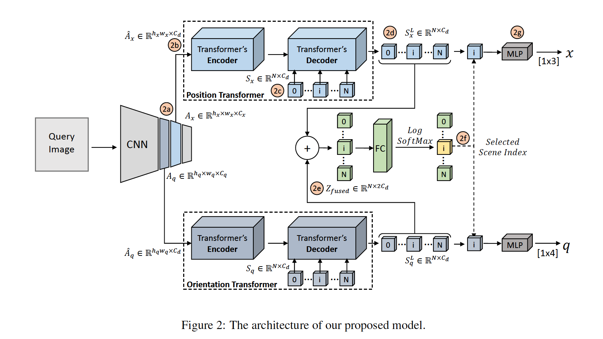
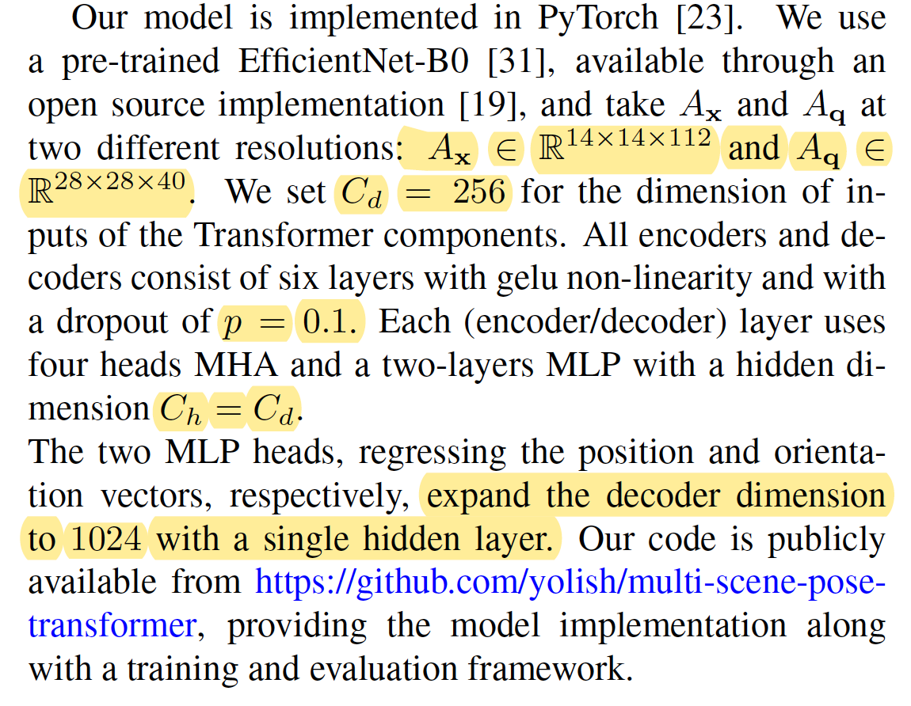

# Learning Multi-Scene Absolute Pose Regression with Transformers

## Abstract

Absolute camera pose regressors estimate the position and orientation of a camera *from* the captured image alone. Typically, a convolutional backbone with a multi-layer perceptron head is trained using images and pose labels to embed a single reference scene at a time. Recently, this scheme was extended for learning multiple scenes by replacing the MLP head with a set of fully connected layers. In this work, we propose to learn multi-scene absolute camera pose regression with Transformers, where encoders are used to aggregate activation maps with self-attention and decoders transform latent features and scenes encod- ing into candidate pose predictions. This mechanism allows our model to focus on general features that are informative for localization while embedding multiple scenes in parallel. We evaluate our method on commonly benchmarked  indoor and outdoor datasets and show that it surpasses both multi-scene and state-of-the-art single-scene absolute pose regressors.

We make our code publicly available from https://github.com/yolish/multi-scene-pose-transformer.

**Let's see what do we get in Abstract**

- Use a fully connected layers to replace the MLP head ??? (What's the difference? )

- Encoder: Aggregate activation maps with self-attention
- Decoder: transform latent features and scenes into pose predictions
- Focus on general features
- Multiple scenes and parallel

## 1. Introduction

- Hierarchical localization pipeline
- The extracted 2D-2D matches are mapped to 2D-3D correspondences via depth or a 3D point cloud. (Perspective-n-Point(PnP) and RANSAC)
  - Absolute pose regressors (APRs): faster and more efficient, but less accuracy
  - Kendall's formulation of absolute camera pose regression: GoogleNet+MLP
  - Commons
    - Use CNN backbone to output a single global latent vector which is used for a regressing pose
    - Training per scene
- Uses FCBlock to replace MLP
- Main Contributions
  -  a novel formulation for multi-scene abso-lute pose regression using Transformers
  - demonstrate that self-attention al-lows  aggregation  of  positional  and  rotational  imagecues
  - SOTA on both indoors and outdoors for both multi-scene and single-scene APRs across

## 2. Related Work

Camera pose estimation methods can be divided into several families, **depending on the inputs at inference time on their algorithmic characteristics.**  

- **Image Retrieval** -- for retrieving database images that depict the vicinity of the area captured by the query image.
  - needs a large database
- **3D-based Localization** aka structure-based methods -- PnP and RANSAC
- **Relative Pose Regression**: generalize better than APRs

- **Absolute Pose Regression**: attach an MLP head to a GoogleNet backbone
- **Multi-Scene Absolute Pose Regression**:   framework still involvedtraining multiple models(one per scene)  and then **selecting the most appropriate model using a mixture-of-experts strategy**

***In this work***

We focus on learning a **single** unified deep learning model for APR, add attention model and Transformers in the supplementary material

## 3. Multi-Scene Absolute Camera Pose Regression with Transformers

The output is the pose $$\pmb{p} = <\pmb{x}, \pmb{q}>$$ , $$\pmb{x}$$ is position, and $$\pmb{q}$$ is the quarernion encoding of its 3D orientation.

Apply separate positional and orientational Transformer Decoders, queried by {$$\pmb{x_i}^N_1$$} and {$$\pmb{q_i}^N_1$$}, and output corresponding {$$\pmb{X_i}^N_1$$} and {$$\pmb{Q_i}^N_1$$}, {$$\pmb{X_i}^N_1,\pmb{Q_i}^N_1$$} are regressed by the MLP heads.

### 3.1 Network Architecture

Given an image
$$
I \in \mathbb{R}^{H\times W \times C}
$$
After a convolutional backbone we got the activation map
$$
A_x \in \mathbb{R}^{H_x\times W_x \times C_x} \\ \ A_q\in \mathbb{R}^{H_q\times W_q \times C_q}
$$
And transfer the activation map to a higher dimension, and each position in the activation map is further

assigned with a learned encoding to preserve the spatial information of each location.
$$
\hat{A}_x \in \mathbb{R}^{H_x\times W_x \times C_d} \\ \ \hat{A}_q\in \mathbb{R}^{H_q\times W_q \times C_d}
$$

To reduce the number of parameters, 2 one-dimensional encoding are separately learned. 
$$
\pmb{E}^{i,j}_{pos} = \begin{bmatrix}
\pmb{E}^{j}_u \\
\pmb{E}^{i}_v
\end{bmatrix} \in \mathbb{R}^{C_d}
$$
The processed sequence, serving as input to the Transformer is 
$$
\pmb{Z^0_\hat{A}} = \pmb{\hat{A}} + \pmb{E_A} \in \mathbb{R}^{H_a\times W_a \times C_d}
$$
Where $$\pmb{E_A}$$ is the positional encoding of A
After applying a LayerNorm(LN) before each module and adding back the input with residual connections:
$$
\pmb{Z}^{l′}_\hat{A}   = MHA(LN (\pmb{Z}^{l-1}_\hat{A})) + \pmb{Z}^{l-1}_\hat{A} ∈ R^{H_a·W_a×C_d}  \\
\pmb{Z}^{l}_\hat{A}   = MHA(LN (\pmb{Z}^{l'}_\hat{A})) + \pmb{Z}^{l'}_\hat{A} ∈ R^{H_a·W_a×C_d}
$$
At the final layer, L the output is passed through an additional nomalization
$$
\pmb{Z}^L_\hat{A} = LN(\pmb{Z}_\hat{A}^L)
$$
We got ginal form of output, {$$\pmb{X_i},\pmb{Q_i} = \pmb{Z}_i$$}
$$
\pmb{Z}_i = \begin{bmatrix}\pmb{X_i} \\\pmb{Y_i}\end{bmatrix} \in \mathbb{R}^{2C_d}
$$

### 3.2 Multi-scene Camera Pose Loss

$$
L_x = ||x_0-x||_2 \\
L_q = ||q_0 - \frac{q}{||q||}||_2
$$

where *q* is normalized to a unit norm quaternion in order ensure it is a valid orientation encoding.				

We combine the two losses using the camera pose loss formulation suggested by Kendall et al.
$$
L_p = L_x \ exp(-s_x) + s_x +L_q \ exp(-s_q) + s_q
$$
where $$s_x$$ and $$s_q$$ are learned parameters controlling the balance between the two losses. Since the model is required to classify the scene from the token image, we add a Negative Log Likelihood(NLL) loss term
$$
L_{multi-scene} = L_p + NLL(s, s_0)
$$

### 3.3 Implementation Details

Lazy work...Just copy the photo, the parameters are so important to reproduction

## 4. Experiment

They show a series of comparative experience, and very SOTA. 

Uses 7Scenes and Cambridge datasets, like PoseNet

| **Method**（Cambridge Landmark） | **Average [m/deg]**  | **Ranks**   |
| -------------------------------- | -------------------- | ----------- |
| Single-scene APRs                |                      |             |
| PoseNet [17]                     | 2.09/6.84            | 10/11       |
| BayesianPN [15]                  | 1.92/6.28            | 8/10        |
| LSTM-PN [35]                     | 1.30/5.52            | 2/9         |
| SVS-Pose [21]                    | 1.33/5.17            | 3/7         |
| GPoseNet [8]                     | 2.08/4.59            | 6/3         |
| PoseNet-Learnable [16]           | 1.43/2.85            | 5/2         |
| GeoPoseNet [16]                  | 1.63/2.86            | 6/3         |
| MapNet [7]                       | 1.63/3.64            | 6/5         |
| IRPNet [29]                      | 1.42/3.45            | 4/4         |
| Multi-scene APRs                 |                      |             |
| MSPN [3]                         | 2.47/5.34            | 11/8        |
| **MS-Transformer (Ours)**        | **1.28**/**2.73   ** | **1**/**1** |

| **Method**（7Scenes）     | **Average [m/deg]** | **Ranks** |
| ------------------------- | ------------------- | --------- |
| Single-scene APRs         |                     |           |
| PoseNet [17]              | 0.44/10.4           | 10*/*11   |
| BayesianPN [15]           | 0.47/9.81           | 11*/*8    |
| LSTM-PN [35]              | 0.31/9.86           | 8*/*9     |
| GPoseNet [8]              | 0.31/9.95           | 8*/*8     |
| PoseNet-Learnable [16]    | 0.24/7.87           | 7*/*4     |
| GeoPoseNet [16]           | 0.23/8.12           | 5*/*5     |
| MapNet [7]                | 0.21/7.78           | 4*/*3     |
| IRPNet [29]               | 0.23/8.49           | 5*/*7     |
| AttLoc [36]               | 0.20/7.56           | 2/2       |
| Multi-scene APRs          |                     |           |
| MSPN [3]                  | 0.20/8.41           | 2/6       |
| **MS-Transformer (Ours)** | **0.18/ 7.28**      | **1/1**   |

Their Ablation Study is to find better Hyperparameters
